```mermaid
erDiagram

    %% ============================================================
    %% CORE DOMAIN
    %% ============================================================

    USER {
        int     id               PK
        string  name
        string  email
        string  profile
        boolean active
        boolean online
        string  startWork
        string  endWork
        string  whatsappNumber
        string  currentSessionId
        date    lastLoginAt
    }

    CONTACT {
        int     id               PK
        string  name
        string  number
        string  email
        boolean isGroup
        boolean nameManuallyEdited
        string  messengerId
        string  instagramId
        string  telegramId
        string  webchatId
        string  numberLid
        string  status
        string  profilePicUrl
    }

    TICKET {
        int     id               PK
        string  status
        int     unreadMessages
        string  lastMessage
        boolean isGroup
        boolean pinnedChat
        boolean mutedChat
        boolean favoritedChat
        string  channel
        int     contactId        FK
        int     whatsappId       FK
        int     userId           FK
        int     queueId          FK
    }

    MESSAGE {
        string  id               PK
        int     ack
        boolean read
        boolean fromMe
        text    body
        string  mediaUrl
        string  mediaType
        string  albumId
        int     fileSize
        int     userId
        boolean isDeleted
        boolean isEdited
        boolean isStarred
        boolean isPinned
        int     ticketId         FK
        int     contactId        FK
        string  quotedMsgId      FK
        date    createdAt
    }

    WHATSAPP {
        int     id               PK
        string  name
        string  status
        string  number
        text    greetingMessage
        text    farewellMessage
        string  type
        boolean isDefault
        boolean isDisplay
        boolean isBusiness
        string  color
        string  pairingCode
    }

    QUEUE {
        int     id               PK
        string  name
        string  color
        string  greetingMessage
        string  startWork
        string  endWork
        string  absenceMessage
        string  startBreak
        string  endBreak
        string  breakMessage
        string  n8nUrl
        boolean n8nEnabled
    }

    TAG {
        int    id                PK
        string name
        string color
    }

    QUICKANSWER {
        int  id                  PK
        text shortcut
        text message
        text mediaPath
    }

    SETTING {
        string key               PK
        text   value
    }

    INTEGRATION {
        string key               PK
        text   value
    }

    APITOKEN {
        int    id                PK
        string name
        string token
        string tokenHash
        text   permissions
    }

    PERSONALIZATION {
        int    id                PK
        string theme
        string company
        string primaryColor
        string secondaryColor
        string toolbarColor
        string toolbarIconColor
        text   logo
        text   logoTicket
        text   favico
    }

    CONTACTCUSTOMFIELD {
        int    id                PK
        string name
        string value
        int    contactId         FK
    }

    CLIENTSTATUS {
        int    id                PK
        string name
        string color
    }

    %% ============================================================
    %% PIVOT TABLES (N:M)
    %% ============================================================

    USERQUEUE {
        int userId               FK
        int queueId              FK
    }

    USERWHATSAPP {
        int userId               FK
        int whatsappId           FK
    }

    WHATSAPPQUEUE {
        int whatsappId           FK
        int queueId              FK
    }

    CONTACTTAG {
        int contactId            FK
        int tagId                FK
    }

    TICKETLABEL {
        int id                   PK
        int ticketId             FK
        int whatsappLabelId      FK
    }

    VIDEOUSER {
        int id                   PK
        int videoId              FK
        int userId               FK
    }

    %% ============================================================
    %% EMAIL MODULE
    %% ============================================================

    EMAIL {
        string  id               PK
        string  messageId
        int     whatsappId       FK
        int     contactId        FK
        string  direction
        string  fromAddress
        string  toAddress
        text    subject
        text    bodyHtml
        text    bodyText
        string  folder
        boolean isRead
        boolean isStarred
        string  hubStatus
    }

    EMAILATTACHMENT {
        string id                PK
        string emailId           FK
        string filename
        string mimeType
        text   fileUrl
        string direction
    }

    %% ============================================================
    %% MESSAGE EXTENSIONS
    %% ============================================================

    OLDMESSAGE {
        int    id                PK
        text   body
        string messageId         FK
    }

    MESSAGEREACTION {
        int    id                PK
        string messageId
        string emoji
        string senderId
    }

    POLLVOTE {
        int    id                PK
        string pollMessageId     FK
        string voterId
        string voterName
        string selectedOptions
        date   timestamp
    }

    %% ============================================================
    %% WHATSAPP LABELS
    %% ============================================================

    WHATSAPPLABEL {
        int    id                PK
        int    whatsappId        FK
        string labelId
        string name
        string hexColor
    }

    %% ============================================================
    %% WHATSAPP SATELLITES
    %% ============================================================

    WHATSAPPNOTIFICATION {
        int  id                  PK
        int  whatsappId          FK
        date lastNotificationTime
    }

    GROUPEVENT {
        int    id                PK
        int    whatsappId        FK
        string groupId
        string groupName
        string eventType
        string participantId
        string performedBy
        date   timestamp
    }

    %% ============================================================
    %% TRAINING MODULE
    %% ============================================================

    VIDEO {
        int     id               PK
        string  title
        string  url
        boolean active
    }

    %% ============================================================
    %% AUDIT MODULE
    %% ============================================================

    USERSESSION {
        int    id                PK
        int    userId            FK
        string sessionId
        date   loginAt
        date   logoutAt
        date   lastActivity
    }

    ACTIVITYLOG {
        int    id                PK
        int    userId            FK
        string action
        text   description
        string entityType
        int    entityId
        string ip
    }

    ERRORLOG {
        int    id                PK
        string source
        int    userId
        text   message
        string url
        string severity
        string component
    }

    %% ============================================================
    %% CORE RELATIONSHIPS
    %% ============================================================

    USER         ||--o{ TICKET              : "atende"
    CONTACT      ||--o{ TICKET              : "origina"
    WHATSAPP     ||--o{ TICKET              : "canaliza"
    QUEUE        |o--o{ TICKET              : "classifica"

    TICKET       ||--o{ MESSAGE             : "contém"
    CONTACT      |o--o{ MESSAGE             : "envia"
    MESSAGE      |o--o| MESSAGE             : "cita (quotedMsgId)"

    CONTACT      ||--o{ CONTACTCUSTOMFIELD  : "possui"
    CLIENTSTATUS ||--o{ CONTACT             : "classifica (join por nome)"

    %% ============================================================
    %% PIVOT RELATIONSHIPS
    %% ============================================================

    USER     ||--o{ USERQUEUE      : ""
    QUEUE    ||--o{ USERQUEUE      : ""

    USER     ||--o{ USERWHATSAPP   : ""
    WHATSAPP ||--o{ USERWHATSAPP   : ""

    WHATSAPP ||--o{ WHATSAPPQUEUE  : ""
    QUEUE    ||--o{ WHATSAPPQUEUE  : ""

    CONTACT  ||--o{ CONTACTTAG     : ""
    TAG      ||--o{ CONTACTTAG     : ""

    TICKET       ||--o{ TICKETLABEL    : "etiquetado"
    WHATSAPPLABEL||--o{ TICKETLABEL    : "aplicada a"

    USER     ||--o{ VIDEOUSER      : ""
    VIDEO    ||--o{ VIDEOUSER      : ""

    %% ============================================================
    %% EMAIL MODULE RELATIONSHIPS
    %% ============================================================

    WHATSAPP ||--o{ EMAIL           : "recebe/envia"
    CONTACT  |o--o{ EMAIL           : "participa"
    EMAIL    ||--o{ EMAILATTACHMENT : "possui"

    %% ============================================================
    %% MESSAGE EXTENSIONS RELATIONSHIPS
    %% ============================================================

    MESSAGE ||--o{ OLDMESSAGE : "histórico de edição"
    MESSAGE ||--o{ POLLVOTE   : "recebe votos"

    %% ============================================================
    %% WHATSAPP RELATIONSHIPS
    %% ============================================================

    WHATSAPP ||--o{ WHATSAPPLABEL        : "define labels"
    WHATSAPP ||--o{ WHATSAPPNOTIFICATION : "rastreia notificações"
    WHATSAPP ||--o{ GROUPEVENT           : "gera eventos"

    %% ============================================================
    %% AUDIT RELATIONSHIPS
    %% ============================================================

    USER ||--o{ USERSESSION  : "inicia sessão"
    USER ||--o{ ACTIVITYLOG  : "registra ação"
```

# ERD — Press Ticket® v1.16.3

> Gerado a partir de `backend/src/models/` e `backend/src/database/migrations/`.  
> Fonte de verdade: models TypeScript com decoradores sequelize-typescript.  
> Campos sem `@ForeignKey` formal estão documentados na tabela de inconsistências ao final.

---

---

## Notas de Modelagem

### Por que `Ticket` centraliza canal + fila + usuário + contato

`Ticket` é o **hot path do Socket.io**: toda vez que uma mensagem chega, o sistema emite eventos para todos os clientes conectados usando `ticketId` como chave de sala. Para montar o payload em tempo real — quem atende, em qual fila, por qual canal e para qual contato — todas essas FKs precisam estar na mesma linha. Uma query com quatro JOINs em `Ticket` substitui quatro queries separadas no caminho crítico de latência.

### Como `ContactCustomField` usa o padrão EAV

`ContactCustomField` implementa **Entity–Attribute–Value**: cada linha é um par `(name, value)` vinculado a `contactId`. Permite adicionar campos arbitrários por contato ("CPF", "Segmento", "Plano") sem novas colunas nem migrations. O custo é ausência de tipagem forte e a necessidade de carregar todos os campos do contato e filtrar por nome no código.

### O papel de `Whatsapp.type` para múltiplos provedores

| Valor           | Gateway                      | Canais                                 |
| --------------- | ---------------------------- | -------------------------------------- |
| `wwebjs`        | whatsapp-web.js (Puppeteer)  | WhatsApp pessoal/Business              |
| `notificamehub` | Notificame Hub API           | Facebook, Instagram, Telegram, WebChat |
| `email`         | IMAP/SMTP via Notificame Hub | E-mail                                 |

O mesmo model `Whatsapp` representa os três provedores. Serviços como `wbotMessageListener` verificam `whatsapp.type` antes de rotear para a lógica correta.

---

## Inconsistências documentadas

| Campo                                | Situação                                                              | Impacto                                                                  |
| ------------------------------------ | --------------------------------------------------------------------- | ------------------------------------------------------------------------ |
| `Message.userId`                     | `@Column` sem `@ForeignKey(() => User)` — FK lógica sem restrição ORM | Deletar usuário não anula `userId` nas mensagens; join manual necessário |
| `MessageReaction.messageId`          | `@Column` sem `@ForeignKey` nem `@BelongsTo`                          | Reações órfãs possíveis se a mensagem for deletada                       |
| `ErrorLog.userId`                    | Inteiro de referência sem nenhum decorator de FK                      | Logs de erros de usuários deletados ficam com `userId` inválido          |
| `ClientStatus.name → Contact.status` | Join por **string** (`sourceKey: "name"`), não por PK                 | Renomear um `ClientStatus` não atualiza os contatos associados           |
